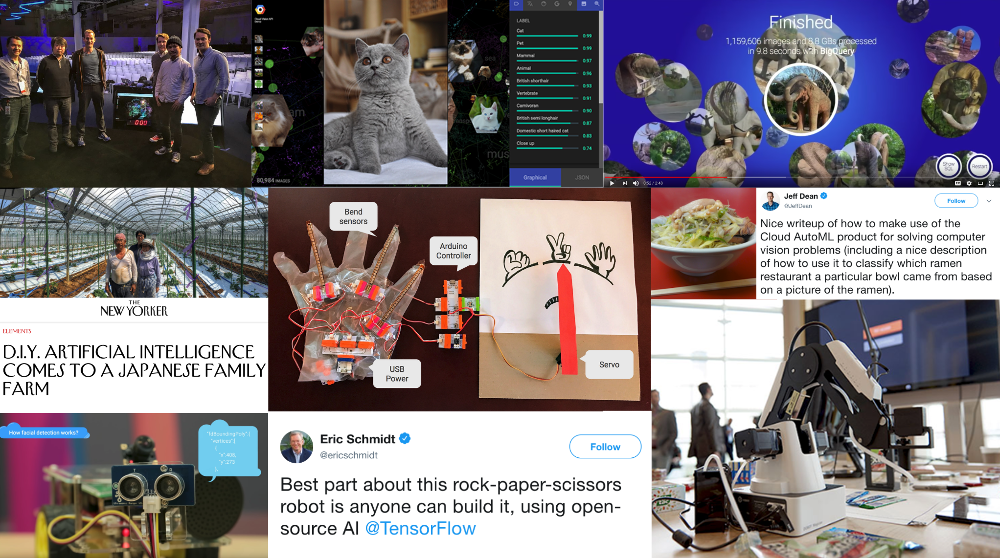

My past blogs and demos

## Bio

Kaz Sato / Staff Developer Advocate, Google Cloud, Google Inc.

Kaz Sato is Staff Developer Advocate at Google Cloud for machine learning and AI products, such as TensorFlow, Cloud AI and BigQuery. Kaz has been invited as a speaker at major events including Google Cloud Next, Google I/O, NVIDIA GTC and etc. Also, authoring many GCP blog posts, supporting developer communities for Google Cloud for over 9 years. He is also interested in hardwares and IoT, and has been hosting FPGA meetups since 2013.

## Bio (Japanese)

佐藤一憲　/ グーグル合同会社 Google Cloud デベロッパーアドボケイト

Google CloudチームのデベロッパーアドボケイトとしてTensorFlow、Cloud AI等の機械学習プロダクトの開発者支援を担当。Google Cloud Next、Google I/O、NVIDIA GTC等の主要イベントでスピーカーを務め、GCP公式ブログ英語版に多数の記事を寄稿。Googleクラウドの開発者コミュニティを9年以上にわたり支援してきたほか、ハードウェアやIoTにも興味を持ちFPGA技術の勉強会を2013年より主宰している。

## Photos:

- [My photo](photo_201802_small.PNG)
- [My past works](past_works.png)

## Links:

- Twitter: [@kazunori_279](https://twitter.com/kazunori_279)
- GitHub: [kazunori279](https://github.com/kazunori279)
- LinkedIn: [kazunori279](https://www.linkedin.com/in/kazunori279/)
- Facebook: [kazunori279](https://www.facebook.com/kazunori279)

## Current session topics

Below is the list of my current session topics.

- [Productionizing ML with ML Ops and Cloud AI](mlops.md)
- [PDF2Audiobook: How to read more books and lose your weight with the power of AI](p2a.md)
- [Fairness and Explainability in ML](mlfairness.md)
- [AutoML Tables and BigQuery ML: Quick and scalable AI analytics on large business data](automl_bqml.md)
- [Getting Started with TensorFlow 2.0 with Google Colab and Cloud AI Platform](tf_intro.md)
- [TensorFlow Lite, AutoML and Edge TPU: how to accelerate your mobile devices with AI](tflite.md)
- [Cloud TPU and Cloud TPU Pod: AI supercomputing for large scale machine learning](TPU.md)

## Featured demos

- [QueryIt Smart](http://queryit.magellanic-clouds.com/): Image search on BigQuery with TensorFlow model
- [Tensor Processing Unit (TPU)](https://tpudemo.com): Explains the TPU design archtecture. See the [blog](https://cloud.google.com/blog/products/ai-machine-learning/what-makes-tpus-fine-tuned-for-deep-learning) for more detail
- [Rock Papar Scissors Machine](https://www.youtube.com/watch?v=hyNruFqe1L0): A simple demo for explaining how ML with linear model works
- [Find your candy](https://youtu.be/lMvV_OGFFck?t=91): Candy sorter demo for Cloud Next with TensorFlow and ML APIs. See the [blog](https://cloud.google.com/blog/big-data/2017/06/build-your-own-machine-learning-powered-robot-arm-using-tensorflow-and-google-cloud) for more details
- [What is Cloud Vision API](https://www.youtube.com/watch?v=eve8DkkVdhI): A fun robot demo with Vision API
- [TensorFlow for absolute beginners (codelab)](https://github.com/kazunori279/TensorFlow-for-absolute-beginners)

## Blog posts, videos and demos

### 2019 videos

- [ML Ops Best Practices on Google Cloud](https://www.youtube.com/watch?v=20h_RTHEtZI) at Cloud Next SF 2019 
- [Cloud TPU Pods: AI Supercomputing  for Large Machine Learning Problems](https://youtu.be/kPMpmcl_Pyw?t=1110) at Google I/O'19

### 2018 blogs

- GCP blog: [Now live in Tokyo: using TensorFlow to predict taxi demand](https://cloud.google.com/blog/big-data/2018/04/now-live-in-tokyo-using-tensorflow-to-predict-taxi-demand) ([JP version](https://cloudplatform-jp.googleblog.com/2018/04/ntt-docomo-ai-taxi-tensorflow.html))
- GCP blog: [AutoML Vision in action: from ramen to branded goods](https://cloud.google.com/blog/big-data/2018/03/automl-vision-in-action-from-ramen-to-branded-goods) ([JP version](https://cloudplatform-jp.googleblog.com/2018/03/automl-vision-in-action-from-ramen-to-branded-goods.html)): featured on [The Keyword](https://www.blog.google/topics/machine-learning/noodle-machine-learning-can-identify-ramen-shop/), [Jeff Dean's tweet](https://twitter.com/JeffDean/status/978510291779465216), and [Fei-Fei Li's talk at Google I/O](https://youtu.be/WWT0ltBf3MU?t=22m23s).
- GCP blog: [Google's ML enables Perfume and Rhizomatics' new challenge on media art (JP version only)](https://cloudplatform-jp.googleblog.com/2018/06/NHK-Perfume-TECHNOLOGY-Reframe-Your-Photo-Google-TensorFlow.html)
- GCP blog: [What makes TPUs fine-tuned for deep learning?](https://cloud.google.com/blog/products/ai-machine-learning/what-makes-tpus-fine-tuned-for-deep-learning) ([JP version](https://cloudplatform-jp.googleblog.com/2018/08/what-makes-tpus-fine-tuned-for-deep-learning.html))

### 2018 videos

- FOSS Asia keynote: [Real-world Machine Learning with TensorFlow and Cloud ML](https://youtu.be/_v23trYkMak)
- Google I/O session: [Machine learning models + IoT data = a smarter world](https://youtu.be/avxpkFUXIfA?t=10m41s)
- Google Cloud Next SF session [What is ML Ops?](https://www.youtube.com/watch?v=_jnhXzY1HCw)

### 2018 demos

- [What is Tensor Processing Unit?](https://tpudemo.com)

### 2017 blogs

- GCP blog: [Using machine learning for insurance pricing optimization](https://cloud.google.com/blog/big-data/2017/03/using-machine-learning-for-insurance-pricing-optimization)
- GCP blog: [An in-depth look at Google’s first Tensor Processing Unit (TPU)](https://cloud.google.com/blog/big-data/2017/05/an-in-depth-look-at-googles-first-tensor-processing-unit-tpu) ([JP version](https://cloudplatform-jp.googleblog.com/2017/05/an-in-depth-look-at-googles-first-tensor-processing-unit-tpu.html)): co-authored with David Patterson and Cliff Young
- GCP blog: [Build your own machine-learning-powered robot arm using TensorFlow and Google Cloud](https://cloud.google.com/blog/big-data/2017/06/build-your-own-machine-learning-powered-robot-arm-using-tensorflow-and-google-cloud) ([JP version](https://cloudplatform-jp.googleblog.com/2017/06/google-io-tensorflow-findyourcandy.html))
- GCP blog: [How Aucnet leveraged TensorFlow to transform their IT engineers into machine learning engineers](https://cloud.google.com/blog/big-data/2017/08/how-aucnet-leveraged-tensorflow-to-transform-their-it-engineers-into-machine-learning-engineers)
- Opensource.com blog: [TensorFlow brings machine learning to the masses](https://opensource.com/article/17/9/tensorflow)
- GCP blog: [My summer project: a rock-paper-scissors machine built on TensorFlow](https://cloud.google.com/blog/big-data/2017/10/my-summer-project-a-rock-paper-scissors-machine-built-on-tensorflow) ([JP version](https://cloudplatform-jp.googleblog.com/2017/10/my-summer-project-a-rock-paper-scissors-machine-built-on-tensorflow.html)): featured on [The Keyword](https://www.blog.google/topics/machine-learning/tensorflow-lends-hand-build-rock-paper-scissors-machine/), [Jeff Dean's Research blog](https://research.googleblog.com/2018/01/the-google-brain-team-looking-back-on.html) and [Eric Schmidt's tweet](https://twitter.com/ericschmidt/status/925432904888541184).

### 2017 GCP YouTube videos

- [BigQuery and Cloud Machine Learning: advancing neural network predictions (Google Cloud Next '17)](https://www.youtube.com/watch?v=Ov3Om5Y_Fbg&feature=youtu.be)
- [Android Meets TensorFlow: How to Accelerate Your App with AI (Google I/O '17)](https://www.youtube.com/watch?v=25ISTLhz0ys)
- [Android Meets TensorFlow: How to Accelerate Your App with AI (GDD India 2017)](https://www.youtube.com/watch?v=Qa_0l94Tvls)
- [Classifying Manhattan with TensorFlow (Cloud Next '17)](https://youtu.be/XEka7Bp41To)
- [Image similarity search with BigQiery (Cloud Next '17)](https://youtu.be/KDWj5Mtotbw)
- [Find your Candy (Cloud Next '17)](https://youtu.be/lMvV_OGFFck)
- [Real-world Machine Learning with TensorFlow and Cloud ML (GDD India 2017)](https://www.youtube.com/watch?v=7yylsf0ewzE)

### 2016 GCP blogs

- [Explore the Galaxy of images with Cloud Vision API](https://cloud.google.com/blog/big-data/2016/05/explore-the-galaxy-of-images-with-cloud-vision-api)
- [Understanding neural networks with TensorFlow Playground](https://cloud.google.com/blog/big-data/2016/07/understanding-neural-networks-with-tensorflow-playground) ([JP version](http://googlecloudplatform-japan.blogspot.in/2016/07/tensorflow-playground.html))
- [How a Japanese cucumber farmer is using deep learning and TensorFlow](https://cloud.google.com/blog/big-data/2016/08/how-a-japanese-cucumber-farmer-is-using-deep-learning-and-tensorflow) ([JP version](http://googlecloudplatform-japan.blogspot.jp/2016/08/tensorflow_5.html)): featured on [The Newsweek](http://www.newsweek.com/artificial-intelligence-cucumber-farm-raspberry-pi-495289), [The New Yorker](https://www.newyorker.com/tech/elements/diy-artificial-intelligence-comes-to-a-japanese-family-farm) and several keynotes at Cloud Next and Google I/O.

### 2016 GCP YouTube videos

- [What is Cloud Vision API](https://www.youtube.com/watch?v=eve8DkkVdhI)
- [What is Cloud Speech API](https://www.youtube.com/watch?v=wzp9dfVpeeg)
- [How to build a smart RasPi Bot with Cloud Vision and Speech API - Google I/O 2016](https://www.youtube.com/watch?v=HpPyhsC4q9M)

## Events

### 2020

- TensorFlow Dev Summit, Sunnyvale (session replaced)
- Google Cloud Next, San Francisco
- Google I/O, Mountain View (event cancelled)

### 2019

- Google Developers ML Summit, Tokyo
- Google Developers ML Summit, Seoul
- Google Developers ML Summit, Taipei
- Let's Talk AI, Taipei
- Google Cloud Next, San Francisco
- Google I/O, Mountain View
- SREcon19 Asia, Singapore 
- O'Reilly AI Conf, Beijing
- Google Cloud Next, Tokyo
- Google Developer Day, Shanghai
- Google DevFest Mumbai and Indore
- Heapcon, Belgrade
- Google GDE Summit, Santa Clara 
- O'Reilly TensorFlow World, Santa Clara (featured speaker)
- Futuristic App Day, Tokyo

### 2018

- FOSS Asia, Singapore (keynote)
- NVIDIA GTC, Santa Clara (featured speaker)
- O'Reilly AI Conf, Beijing
- IEEE COOL Chips, Yokohama (keynote)
- AI Congress, Las Vegas
- O'Reilly AI Conf, NYC
- WeAreDevlopers, Vienna
- Google I/O, Mountain View
- Google for Mobile, Seoul/Tokyo
- Google Cloud Next, San Francisco
- Google Cloud Next, Tokyo (keynote)
- O'Reilly AI Conf, London
- GDG DevFest 2018, Melbourne
- GOTO, Copenhagen
- IEICE Design Gaia 2018, Hiroshima
- Google Developers ML Summit, Tokyo (keynote)

### 2017

- Kalaari Future of AI, Bangalore
- Global AI Conf, Santa Clara
- Developers Summit, Tokyo
- APAC ML Expert Day, Singapore
- Google Cloud Next, San Francisco
- Cloud Conf, Turin
- Slush Tokyo
- ODSC East, Boston
- DevFest DC, Washington DC
- Google I/O, Mountain View
- Apache Big Data, Miami
- IoT World, Santa Clara
- Strata Data Conf, London
- Data Science Summit EU, Jerusalem
- Open Source Summit, Tokyo
- APAC Innovation Summit, Hong Kong
- Apps Japan, Tokyo
- Google Cloud Next, Tokyo
- ML Code Camp, Jeju
- InfiniteConf, London
- AI Summit, Hong Kong
- Google for Mobile, Tokyo
- JupyterCon, New York
- Open Source Summit North America, Los Angeles
- Google Cloud Summit, Mumbai and Bangalore
- ODSC Europe, London
- VoxxedDays, Belgrade
- Data Scientist Association Symposium, Tokyo
- Gartner Symposium, Tokyo
- Horizons, Vienna
- Cloud Expo Europe, Paris
- GOTO Berlin
- GDD India (keynote)
- Strata Data Conf, Singapore

### 2016

- Software Architecture Conference, London
- WebTech Conf, Munich
- ODSC West, Santa Clara
- Think with Google, Tokyo
- Strata + Hadoop World, San Jose
- Google I/O, Mountain View
- ODSC East, Boston
- GOTO Amsterdam
- Hadoop Summit, San Jose 
- Google for Mobile, Tokyo and Korea
- Google Atmosphere, Melbourne and India
- MLconf, Atlanta
